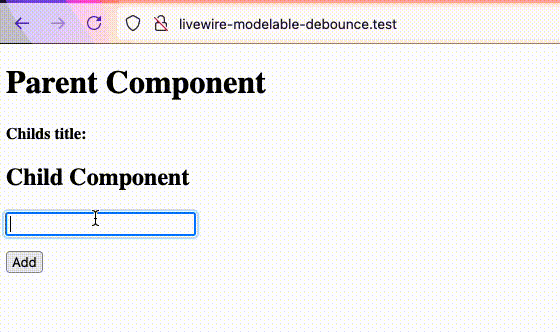

Demo repository to illustrate a bug where debounce is not working with live Modelable properties in some cases.

Debounce works perfectly when the property is updated in the child component by binding to an input.
When you modify the property in an other way, like clicking a button, debounce is not taken into account.



## Relevant code

### Parent component

```php
class ParentComponent extends Component
{
    public string $childTitle = '';

    public function render()
    {
        return view('livewire.parent-component');
    }
}
```

```html
<div>
    <h1>Parent Component</h1>

    <p>
        <strong>Childs title: </strong> {{$childTitle}}
    </p>

    <livewire:child-component wire:model.live.debounce.1000ms="childTitle" />
</div>
```

### Child Component

```php
class ChildComponent extends Component
{
    #[Modelable]
    public string $title = '';

    public function render()
    {
        return view('livewire.child-component');
    }
    
    public function add()
    {
        $this->title .= fake()->word() . ' ';
    }
}
```

```html
<div>
    <h2>Child Component</h2>

    <input type="text" wire:model.live.debounce.1000ms="title">

    <p>{{$title}}</p>

    <button wire:click="add">Add</button>
</div>
```
